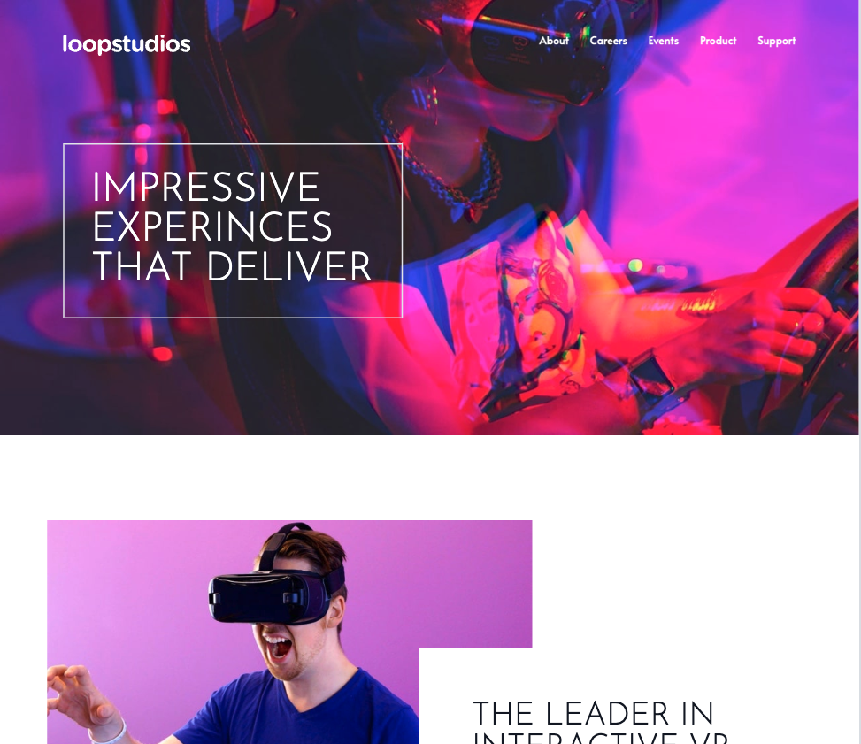

## Table of contents

---

- [Overview](#overview)
  - [The challenge](#the-challenge)
  - [Screenshot](#screenshot)
  - [Links](#links)
- [My process](#my-process)
  - [Built with](#built-with)
  - [What I learned](#what-i-learned)
- [Author](#author)

## Overview

---

### The challenge

Users should be able to:

- View the optimal layout for the section depending on their device's screen size
- See hover states for all interactive elements on the page
- Responsive header with a mobile menu and hamburger icon

### Screenshot



---

center;

### Links

- Solution URL: [Github](https://github.com/gumrahsindar/loopstudio-website)
- Live Site URL: [Vercel](https://loopstudio-website-navy.vercel.app/)

## My process

---

### Built with

- Semantic HTML5 markup
- CSS custom properties
- Flexbox
- CSS Grid
- Mobile-first workflow
- [React](https://reactjs.org/) - JS library
- [Tailwind CSS](https://tailwindcss.com/) - For styles
- [Vite](https://vitejs.dev/) - Build tool

### What I learned

- In this project, I learned how to use a React transition library called [React Transition Group](https://reactcommunity.org/react-transition-group/transition). I used it to animate the mobile menu. I also learned how to create a hamburger menu with Tailwind CSS and manupulate it with React.

````jsx
import { useState } from 'react'
import { TransitionGroup, CSSTransition } from 'react-transition-group'

{/* hamburger button */}
          <div className='md:hidden'>
            <button
              id='menu-btn'
              type='button'
              className={`z-40 block hamburger md:hidden focus:outline-none ${
                toggleHamburger ? 'open' : ''
              }`}
              onClick={() => {
                settoggleHamburger(!toggleHamburger)
                settoggleMenu(!toggleMenu)
              }}
            >
              <span className='hamburger-top'></span>
              <span className='hamburger-middle'></span>
              <span className='hamburger-bottom'></span>
            </button>
          </div>
        </nav>
        {/* mobile menu */}
        <TransitionGroup>
          {toggleMenu && (
            <CSSTransition classNames='menu-animation' timeout={300}>
              <div
                className={`menu absolute top-0 bottom-0 left-0 flex flex-col self-end w-full min-h-screen py-1 pt-40 pl-12 space-y-3 text-lg text-white uppercase bg-black opacity-90 ${
                  toggleMenu ? 'flex' : 'hidden'
                }`}
              >
                <a href='#' className='hover:text-pink-500'>
                  About
                </a>
                <a href='#' className='hover:text-pink-500'>
                  Careers
                </a>
                <a href='#' className='hover:text-pink-500'>
                  Events
                </a>
                <a href='#' className='hover:text-pink-500'>
                  Products
                </a>
                <a href='#' className='hover:text-pink-500'>
                  Support
                </a>
              </div>
            </CSSTransition>
          )}
        </TransitionGroup>
        ```


## Author

---

- LinkedIn - [Gümrah Sindar](https://www.linkedin.com/in/gumrahsindar/)
- Frontend Mentor - [@gumrahsindar](https://www.frontendmentor.io/profile/gumrahsindar)
- Twitter - [@gmrhsndr](https://twitter.com/gmrhsndr)
````
